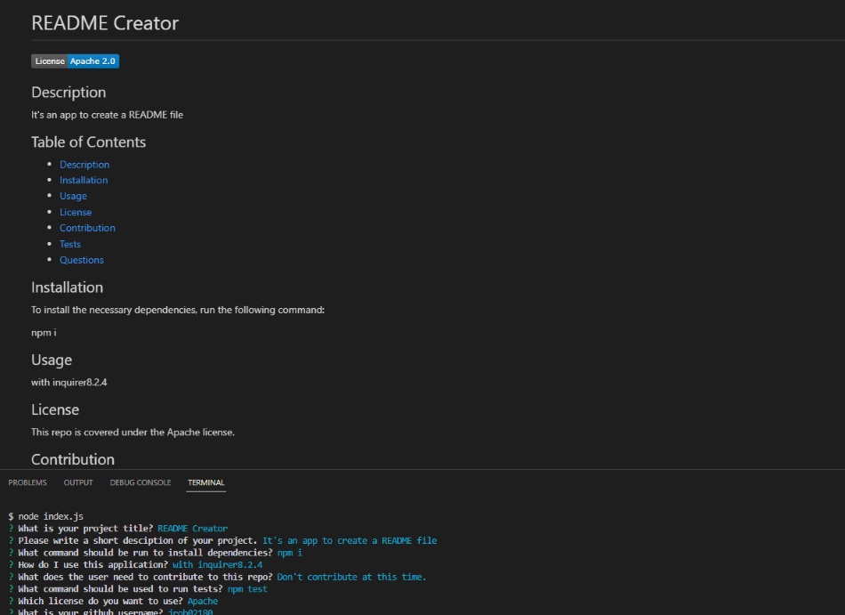

# README Creator

## Description

This is a command-line application that takes user input and creates a professional README.md.

## Table of Contents

- [Description](#description)
- [Installation](#installation)
- [Usage](#usage)
- [License](#license)

## Installation

From your terminal, install inquirer 8.2.4, then clone the code from this repo into your terminal. 

## Usage Information

Open the integrated terminal from your index.js file. Run node index.js and follow the prompts. Your README file will then be created!

## License

## Images

### Video Link

https://drive.google.com/file/d/1H4LUTmTGXRoqmhxahlDB0D7yUldLNAbh/view?usp=sharing
